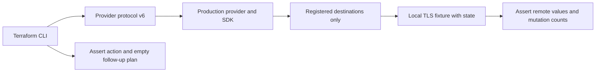

# Regression testing

Run the provider through Terraform before changing resource lifecycle or
planning behavior. These tests assert the plan, persisted state and API side
effects independently, including empty plans after refresh.

## Run

Use the Go version in `go.mod` and a local Terraform CLI. CI pins Terraform
1.11.4 and 1.12.2; these are compatibility baselines, not coverage of every
release. Terraform 1.11 introduced the write-only attributes used by this provider.

```sh
make go-test           # Unit tests and the schema contract; no Terraform required
make test-contract     # Real Terraform, local APIs, race detector
make test-regression   # Both suites with the race detector
```

If Terraform is not on `PATH`:

```sh
TF_ACC_TERRAFORM_PATH=/absolute/path/to/terraform make test-regression
```

The `contract` build tag isolates CLI-dependent tests. A missing CLI fails the
suite instead of skipping it or downloading one. No cloud credentials or
`TF_ACC` setting are needed. Go dependencies may need downloading on the first run.

## Framework structure

```text
mgc/
  internal/contracttest/
    runtime.go          # CLI prerequisite, process-wide HTTP isolation
    provider.go         # Production provider factories and local endpoint config
    http.go             # TLS fixtures, allowlist and fixed-host aliases
    plans.go            # Expected action and post-apply convergence
    http_test.go        # Tests for the isolation/routing helpers
  contract/
    network/
      main_test.go      # os.Exit(contracttest.Run(m))
      fixture_test.go   # Stateful REST simulator and configuration helpers
      lifecycle_test.go # Terraform scenarios and assertions
  schema_contract_test.go
  testdata/schema-contract.golden
```

Each domain has its own Go test package and process. Tests within a domain run
serially because the SDK uses shared HTTP clients. Add domain simulators beside
their scenarios; put reusable CLI, routing or plan behavior in `contracttest`.
The shared package is build-tagged and does not enter normal provider builds.



`Case()` configures HashiCorp's
[`terraform-plugin-testing`](https://developer.hashicorp.com/terraform/plugin/framework/acctests)
with the production protocol v6 provider server. Resource methods and SDK
services remain real; only the remote API is simulated.

`StablePlan(address, action)` checks the intended action before apply and
requires empty plans both before and after refresh. The fixture independently
verifies stored data, creation counts and deletions. `CheckDestroy` checks the
fixture, not just the Terraform state.

## Add a domain or regression

1. Create `mgc/contract/<domain>` with an external test package. Copy the
   `TestMain` pattern from `network/main_test.go`.
2. Add a stateful handler in `fixture_test.go`. Start it with `Server(t, api)`
   and use `ProviderConfig(server.URL)` for local service endpoints. Reject
   unexpected paths, methods and mutations.
3. Build scenarios with `Case()` and `StablePlan`. Assert both Terraform
   attributes and remote fixture data; verify the resource is absent after
   successful cleanup or retained after a failed operation.
4. Run a new regression against its parent branch and confirm the intended
   behavioral failure. Commit it with the correction so each PR remains green.
   Never hide drift with `ExpectNonEmptyPlan` or weaken the fixture to accept it.
5. Run `make test-regression`. API/SDK changes also require reviewing the
   fixture against the service's documented API.

Use `regression_test.go` when separating defect cases from the ordinary lifecycle
helps review. The existing network scenarios are runnable examples of creation,
no-op, CLI import, HCL import and recovery from a read error.

## Coverage

| Domain/layer | Current contracts |
| --- | --- |
| Schema | All registered resources, data sources and provider attributes: names, types, nesting, required/optional/computed, sensitive/write-only flags and schema versions. |
| Framework | Unregistered hosts are rejected before transport; fixed-host aliases route to registered local TLS servers without changing the original SDK request. |
| VPC baseline | Create and destroy exactly once, repeat apply without drift, CLI import verification, persisted HCL import without recreation, and preservation of state across a 403. |
| Object Storage | Known retention state after create; changed content/source path uploads equal-length new bytes in place; unchanged inputs do not re-upload; external deletion recovery and CLI import metadata. |
| VPC recovery | A missing VPC is recreated; a failed create retains its ID for explicit replacement and cleanup. Polling returns deadline/cancellation errors. |
| Block Storage | Attachment polling respects cancellation/deadlines while preserving its initial settling interval; a pending status cannot become success by timeout. Accepted attachments retain state on failure; real Terraform checks explicit replacement, detach-before-attach and no-op recovery. |

## Schema review

`testdata/schema-contract.golden` freezes the published wire schema, omitting
prose descriptions. Review compatibility with existing configuration and state
before intentionally updating it:

```sh
UPDATE_SCHEMA_CONTRACT=1 go test ./mgc -run '^TestProviderSchemaContract$' -count=1
git diff -- mgc/testdata/schema-contract.golden
```

Do not regenerate the baseline merely to make CI green. Add state migration
tests when required. This is a schema review gate, not a migration test;
`RequiresReplace` and other plan modifiers need Terraform plan assertions.

## Isolation and limits

The HTTP transport rejects every unregistered destination and fails the suite
if any request was blocked. TLS trusts the fixture's certificate; verification
is not disabled. Provider configuration uses fixed dummy UUIDs. Never supply
real credentials to these commands.

`Alias` supports SDKs with fixed endpoint names by rewriting a registered
origin to a local server before DNS or network transport. A domain that needs
it must document why; the target must already be registered with `Server`.

These tests cover the CLI-to-HTTP flow, not the behavior of a deployed cloud
API. They do not verify real authentication, cloud provisioning or every
resource lifecycle. Schema checks cover the full registered surface; lifecycle
coverage expands with each domain suite.

## CI

The contract workflow runs both pinned CLIs with `-race` on pull requests to
any base branch (including stacked PRs) and pushes to `main`. The normal Go suite checks the schema baseline. Test fixtures
in the existing DBaaS unit tests capture request filters per subtest, allowing
those tests to remain parallel without sharing mutable assertion state.

Repository administrators must separately require these checks in branch
protection. Workflow files alone do not configure that remote policy.
